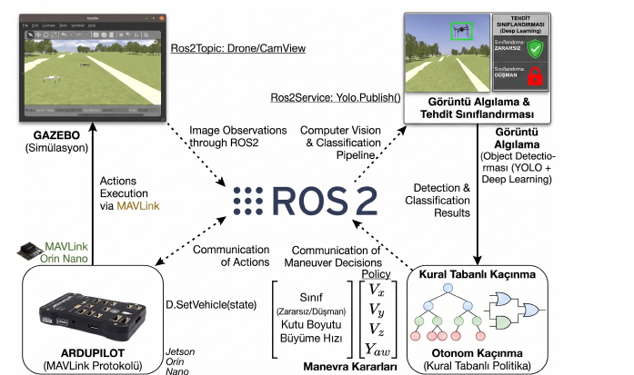

# SAYZEK — Otonom İHA Tehdit Tespiti, Sınıflandırma ve Kaçınma

**[🇬🇧 English](README.en.md) | 🇹🇷 Türkçe**

> **Otonom Hava Sistemleri için Gelişmiş Görüntü İşleme Tabanlı Tehdit Tespiti, Sınıflandırma ve Kaçınma**
> Eren Altun, Mustafa Kale — Yazılım Mühendisliği, Karabük Üniversitesi

YOLO26 ile düşman İHA tespiti, piksel tabanlı mesafe kestirimi, kural tabanlı adaptif kaçınma ve daha önce görülmemiş İHA tipleri için sahada otomatik veri toplama (az örnekle adaptasyon) sistemi. Tüm bileşenler **NVIDIA Jetson Orin Nano** üzerinde **Hardware-in-the-Loop (HIL)** ortamında doğrulanmıştır.

📄 [Makale](docs/paper.pdf) · 🖼️ [Poster](docs/poster.pdf) · ▶️ [Sunum videosu](https://www.youtube.com/watch?v=yl1YAEBlThU&t=23s)

## Öne çıkan sonuçlar

| Sonuç | Değer |
|---|---|
| YOLO26-1280 tespit menzili (Jetson Orin Nano, HIL) | **21,6 m** |
| YOLO26-960 / YOLO26-640 tespit menzili | 15,4 m / 11,5 m |
| Simülasyonda kaçınma başarı oranı | **%86,7** (16 girişimden 13'ü) |
| Otonom veri toplama | 30 kare, insan müdahalesiz, YOLO formatında etiketli |

## Mimari



Simülasyon (Gazebo + ArduPilot SITL) **laptop**'ta çalışır. Model çıkarımı ve hareket komutu üretimi **Jetson**'da yapılır. İki taraf LAN (Ethernet) üzerinden ROS2 (Fast DDS) ve MAVLink ile haberleşir.

Jetson tarafında dört paralel iş parçacığı vardır (`maxsize=1` kuyruklar, her zaman en taze veri):

| Thread | Görev |
|---|---|
| T1 – Tespit | ROS2 kamera topic'inden kare alır, YOLO26 (TensorRT) çıkarımı yapar |
| T2 – Kontrol | Vx/Vy/Vz/Yaw hesaplar; OrbitCollector ve FewShotTracker'ı yönetir |
| T3 – MAVLink | Hız komutlarını 20 Hz ile ArduPilot'a gönderir; RTL ayrı kuyruktan gider |
| T-RTL | Terminale `rtl` yazılınca anlık RTL |

## Depo yapısı

```
├── jetson/        # Jetson Orin Nano'da çalışan ana sistem
│   ├── thread_manager.py     # giriş noktası (T1–T3, HUD, CSV log)
│   ├── yolo_detector.py      # ROS2 kamera + YOLO26 tespiti
│   ├── yolo_controller.py    # durum makinesi, EMA, Kalman, kaçınma kontrol yasaları
│   ├── drone_guard.py        # DroneKit / MAVLink hız ve RTL komutları
│   ├── orbit_collector.py    # otomatik sweep + etiketli veri toplama
│   ├── few_shot_tracker.py   # HSV histogram ile hedef kimlik takibi
│   ├── config.yaml           # eşikler, kazançlar, filtre ve orbit parametreleri
│   └── fastdds_jetson.xml
├── laptop/        # Simülasyon tarafı
│   ├── senaryo.py                        # iris_2 (düşman) PID takip senaryosu
│   ├── bicopter_ros_otonom_etiketleme.py # Gazebo'dan otomatik YOLO etiketli veri seti üretimi
│   ├── bicopter_hold.py                  # bicopter'ı havada sabit tutma yardımcısı
│   └── fastdds_laptop.xml
├── tools/
│   ├── export_640.py                     # .pt → TensorRT .engine (FP16)
│   └── model_karsilastirma_jetson.py     # Jetson'da model karşılaştırma testi
└── docs/          # makale ve poster
```

## Kurulum

**Gereksinimler:** Ubuntu 22.04, ROS2 Humble, Gazebo Harmonic, ArduPilot SITL, Python 3.10. Jetson tarafında JetPack (CUDA/TensorRT).

```bash
pip install -r requirements.txt
```

Model ağırlıkları (`*.pt`, `*.engine`) depoda **yoktur**. Kendi eğittiğiniz `Yolo26-640.pt` dosyasını `tools/` içinde `.engine` formatına çevirin:

```bash
python tools/export_640.py     # dosya adını script içinde MODEL_ADI ile ayarlayın
```

`.engine` dosyası cihaza özeldir; Jetson üzerinde üretilmelidir.

## Çalıştırma

**1) Laptop:** Gazebo + ArduPilot SITL'i başlatın; MAVProxy ile iris_1 ve iris_2 portlarını Jetson'a yönlendirin:

```bash
mavproxy.py --master=udp:127.0.0.1:14550 --out=udp:<JETSON_IP>:14550
mavproxy.py --master=udp:127.0.0.1:14560 --out=udp:<JETSON_IP>:14560
python laptop/senaryo.py          # iris_2 (düşman) iris_1'i kovalar
```

**2) Jetson** (iris_1 havadayken; `config.yaml` çalışma dizininden okunduğu için `jetson/` içinden çalıştırın):

```bash
cd jetson
python thread_manager.py --drone
```

Çıkış için `q`, acil dönüş için terminale `rtl`.

**Ağ ayarı:** `fastdds_*.xml` dosyalarındaki IP'ler (`10.42.0.1` laptop, `10.42.0.67` Jetson) örnek yapılandırmadır; kendi ağınıza göre değiştirin ve kullanmak için:

```bash
export FASTRTPS_DEFAULT_PROFILES_FILE=/path/to/fastdds_jetson.xml   # laptopta fastdds_laptop.xml
```

## Bilinen notlar

- `jetson/yolo_detector.py` içindeki `ENEMY_TOO_CLOSE_PX=230` / `ENEMY_TOO_FAR_PX=57` değerleri `config.yaml` ve makaledeki Tablo I (130 / 45) ile farklıdır; `too_close`/`too_far` bayrağını bu sabitler belirler.
- `laptop/bicopter_hold.py` içinde `MODE_QRTL = 20` yazıyor; ArduPlane'de QLAND=20, QRTL=21'dir.
- Tüm sonuçlar simülasyon/HIL verisidir; gerçek uçuş testleri gelecek çalışmadır.

## Lisans

Ultralytics YOLO (AGPL-3.0) kullanıldığı için bu depo **AGPL-3.0** ile lisanslanmıştır. Bkz. [LICENSE](LICENSE).

## Atıf

Bu projeyi akademik veya teknik çalışmalarınızda kullanıyorsanız, lütfen şu şekilde atıfta bulunun:

## Atıf

Bu projeyi akademik veya teknik çalışmalarınızda kullanıyorsanız, lütfen şu şekilde atıfta bulunun:

```bibtex
@misc{altun_kale_sayzek,
  author       = {Altun, Eren and Kale, Mustafa},
  title        = {Otonom Hava Sistemleri için Gelişmiş Görüntü İşleme Tabanlı Tehdit Tespiti, Sınıflandırma ve Kaçınma},
  institution  = {Karabük Üniversitesi},
  year         = {2026},
  howpublished = {\url{https://github.com/ErenAltun2/Sayzek-Drone-Evasion}}
}
```
